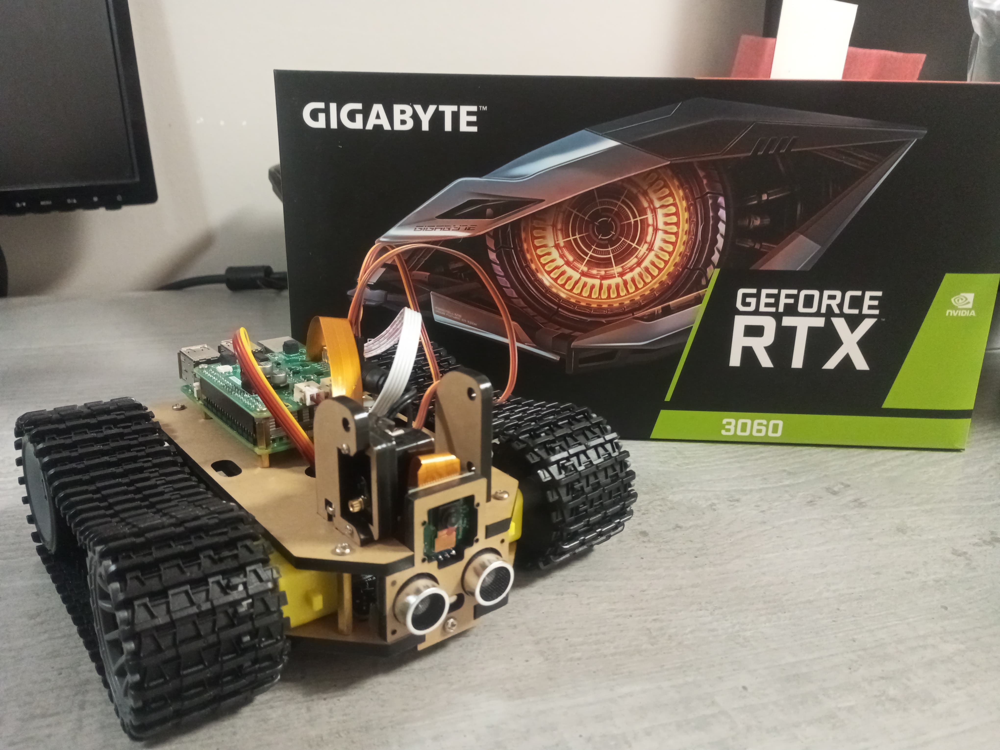

---

# **AIXY - Intelligent Autonomous Robot with TTS, STT, and Computer Vision**



**AIXY** is an intelligent autonomous robot designed to interact with the environment efficiently and dynamicly, using **Text-to-Speech (TTS)** and **Speech-to-Text (STT)**, as well as computer vision for object recognition and navigation. It combines modern **artificial intelligence** (AI), **autonomous navigation**, and **sensors** to operate independently.

---

## **Features**

- **Full Autonomy**: Capable of performing tasks independently using sensors and AI to perceive and respond to the environment.
- **Natural Interaction**: With **TTS** and **STT** integration, AIXY can speak and understand your voice, like a ai assistent.
- **Computer Vision**: Equipped with a camera to detect and recognize objects in the environment.
- **Scalability and Flexibility**: The robot's architecture is designed to be easily adaptable to various scenarios and functions.

---

## **Technologies Used**

- **Programming Languages**: Python
- **Robot Hardware Platform**: Raspberry Pi 5
- **AI Server Hardware Platform**: DELL GTX1080 8GB and Gigabyte Gaming OC RTX3060 12GB in one Intel Xeon E5-2680V4 with 32GB DDR4 ECC of RAM
- **LLM (Large Language Model)**: [gemma2:2b](https://ollama.com/library/gemma2:2b)
- **LVM (Large Vision Model)**: [llava:7b](https://ollama.com/library/llava:7b)
- **TTS (Text to Speech)**: [gTTS](https://pypi.org/project/gTTS/)
- **STT (Speech to Text)**: [OpenAI Whisper](https://github.com/openai/whisper)
- **Sensors**: Ultrasonic sensor for front distance detection, camera for computer vision

---

## **Features**

### **1. Autonomous Navigation**
- AIXY can navigate unknown environments and adjust its path as needed, using the front ultrasonic sensor and the camera to avoid obstacles and optimize routes.

### **2. Image Processing**
- With the camera, AIXY is capable of recognizing objects and performing tasks based on computer vision, such recognizing specific objects.

### **3. Voice Communication**
- With AIXY you can have a mobile intelegent assistent

---

## **Folder Structure**

```
.
├── images
│   └── aixy.jpeg
├── LICENSE
├── LICENSE-OLLAMA
├── LICENSE-OPENAI-WHISPER
├── README.md
├── scripts
│   └── installTTSdependencys.sh
├── src
│   ├── brain.py
│   ├── camera.py
│   ├── commands.py
│   ├── controller.py
│   ├── conversation.py
│   ├── env.py
│   ├── llm.py
│   ├── main.py
│   ├── personality.info
│   ├── purpose.info
│   ├── requirements.txt
│   ├── servoCalibrator.py
│   ├── sttClient.py
│   ├── stt.py
│   ├── sttServer.py
│   ├── tank.py
│   ├── tts.py
│   ├── utils.py
│   ├── vision.py
│   ├── webserver
│   │   └── index.html
│   ├── webserver.py
│   └── xbox360_controller.py
└── thank.you

```

---

## **Contribution**

The project is **still under development**, but contributions are always welcome! You can contribute in several ways:

- Report Bugs: If you encounter any issues, please open an issue report.
- Suggest Improvements or New Features: Share ideas for new features or improvements.
- Documentation: Help improve the project documentation to make it easier for others to get involved.

---

## **License**

This project is licensed under the MIT License - see the [LICENSE](./LICENSE) file for more details.

---

## **Contact**

For more information or inquiries, you can contact me via email:  
**pedrolucas dot core7i @gmail dot com**

---