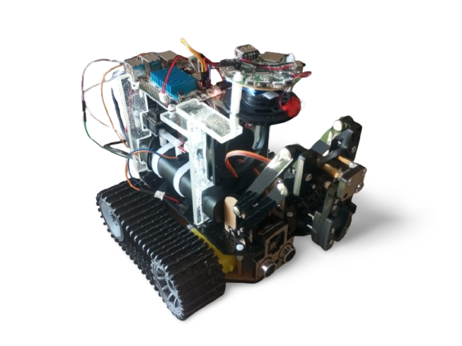

---

# **AIXY2.0 - Intelligent Autonomous Talking Robot**



**AIXY** is an intelligent autonomous robot designed to interact with the environment efficiently and dynamicly, using **Text-to-Speech (TTS)** and **Speech-to-Text (STT)**, as well as computer vision thought **large vision models (LVM)** for object recognition and navigation. It combines modern **artificial intelligence** (AI), **autonomous navigation**, **web dashboards** and **sensors** to operate independently.

---

## **Features**

- **Full Autonomy**: Capable of performing tasks independently using sensors and AI to perceive and respond to the environment.
- **Natural Interaction**: With **TTS** and **STT** integration, AIXY can speak and understand your voice, like a **ai assistent**.
- **Computer Vision**: Equipped with a camera to detect and recognize objects in the environment.
- **Manual Mode Available**: In some cases is a good idea have the manual control mode also available.
- **Web Dashboard Available** to control and view the robot data.
- **Scalability and Flexibility**: The robot's architecture is designed to be easily adaptable to various scenarios and functions.
- **Modularity** you can enable or disable diferent functions and hardware just setting variables as true or false.
- **More than a robot**: this code can be used more than for make the AiXY2.0, **it can be used to make many others AI robots by you**, you just have to specify my **[MIT LICENSE](./LICENSE)**.

---

## **Technologies Used**

- **Programming Languages**: Python3
- **Robot Hardware Platform**: Le Potato and Arduino UNO. ***(You can use others sbc's from others brands)***
- **AI Server Hardware Platform**: DELL GTX1080 8GB and Gigabyte Gaming OC RTX3060 12GB in one Intel Xeon E5-2680V4 with 32GB DDR4 ECC of RAM
- **LLM (Large Language Model)**: [llama3.2:3b](https://ollama.com/library/llama3.2:3b)
- **LVM (Large Vision Model)**: [llava:7b](https://ollama.com/library/llava:7b)
- **TTS (Text to Speech)**: [edge-tts](https://pypi.org/project/edge-tts/)
- **STT (Speech to Text)**: [OpenAI Whisper](https://github.com/openai/whisper)
- **Sensors**: Ultrasonic sensor for front distance detection, camera for computer vision
- **WiFi (Hotspot)**: To access the server in many diferent areas with phone signal

---

## **Folder Structure**

```
.
├── images
│   ├── AiXY2.0.png
│   └── aixy.jpeg
├── LICENSE
├── LICENSE-OLLAMA
├── LICENSE-OPENAI-WHISPER
├── README.md
├── scripts
│   ├── dependencies.sh
│   ├── run.sh
│   └── startup.sh
├── service
│   ├── aixy.service
│   └── aixy-startup.service
├── src
│   ├── aixy.py
│   ├── camera.py
│   ├── commands.py
│   ├── db.py
│   ├── env.py
│   ├── HardwareController
│   │   └── AIXY2.0_Hardware_Controller
│   │       └── AIXY2.0_Hardware_Controller.ino
│   ├── hardware.py
│   ├── listener.py
│   ├── llm.py
│   ├── main.py
│   ├── message.mp3
│   ├── personality.info
│   ├── purpose.info
│   ├── speaker.py
│   ├── WCS_thread
│   │   ├── static
│   │   │   ├── CSS
│   │   │   │   └── style.css
│   │   │   ├── IMG
│   │   │   │   └── CAMERANOTFOUND.jpg
│   │   │   └── JS
│   │   │       └── joystick.js
│   │   └── webserver
│   │       ├── index.html
│   │       └── xterm.html
│   └── xbox360_controller.py
└── thank.you

```

---

## **Contribution**

The project is **still under development**, but contributions are always welcome! You can contribute in several ways:

- **Report Bugs**: If you encounter any issues, please open an issue report.
- **Suggest Improvements** or **New Features**: Share ideas for new features or improvements by creating a new Issue.
- **Documentation**: Help improve the project documentation to make it easier for others to get involved.

---

## **License**

This project is licensed under the MIT License - see the [LICENSE](./LICENSE) file for more details.

---
